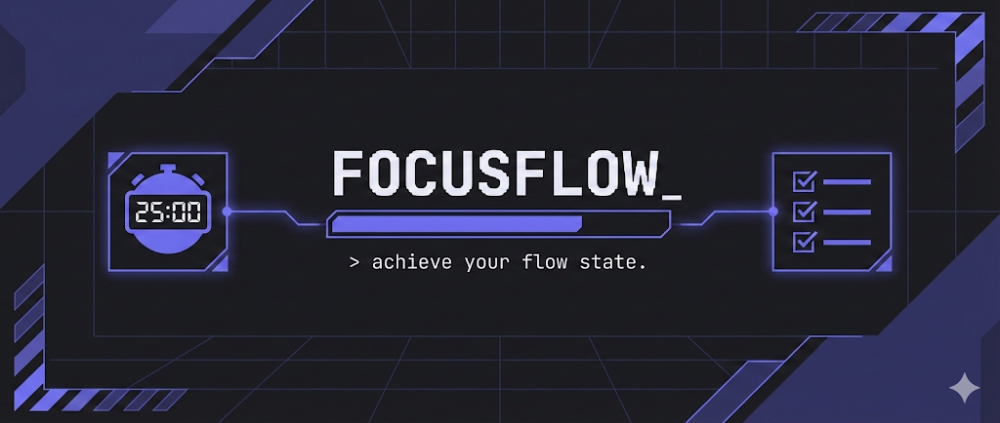
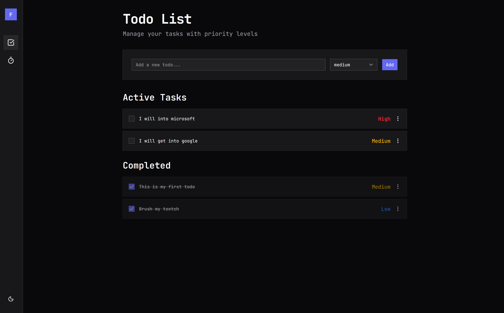
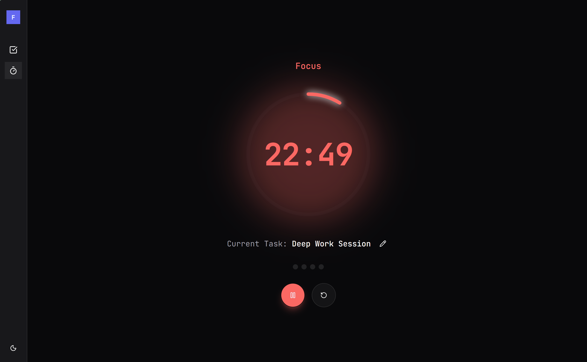
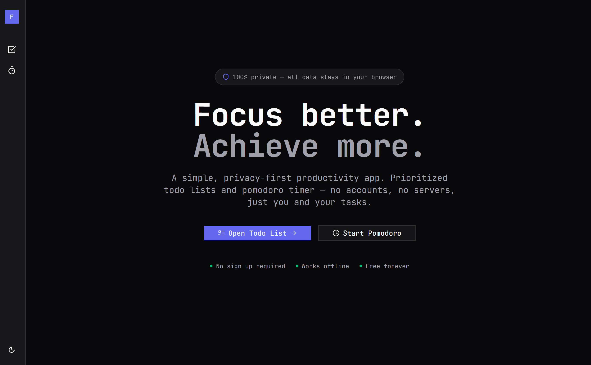

# FocusFlow

A simple, privacy-first productivity app combining prioritized todo lists with the Pomodoro technique. No accounts, no servers — just you and your tasks.



## Features

- **Priority-based Tasks** — Organize tasks by high, medium, and low priority. High priority items always appear at the top.
- **Pomodoro Timer** — 25-minute focus sessions with short and long breaks. Visual cues help you stay in the zone.
- **100% Private** — All data stays in your browser. No accounts, no tracking.
- **Persistent Storage** — Your tasks and progress are saved locally via localStorage.
- **Works Offline** — No network required. Everything runs client-side.
- **Dark & Light Mode** — Automatically adapts to your system preference.

## Screenshots

<!-- Add your screenshots here -->

<div align="center">
  
  
</div>

<div align="center">
  
</div>

## Getting Started

### Prerequisites

- Node.js 18+ 
- pnpm (recommended), npm, or yarn

### Installation

```bash
# Clone the repository
git clone https://github.com/nikitanegi0408/focusflow.git
cd focusflow

# Install dependencies
pnpm install

# Start the development server
pnpm dev
```

Open [http://localhost:3000](http://localhost:3000) in your browser.

## Tech Stack

- **Framework** — [Next.js 16](https://nextjs.org/) with App Router
- **Styling** — [Tailwind CSS](https://tailwindcss.com/)
- **Components** — Custom UI components with [shadcn/ui](https://ui.shadcn.com/) patterns
- **Icons** — [Lucide React](https://lucide.dev/)
- **Storage** — Browser localStorage (no backend required)

## Project Structure

```
├── app/
│   ├── page.tsx          # Landing page
│   ├── todo/
│   │   └── page.tsx      # Todo list app
│   └── pomodoro/
│       └── page.tsx      # Pomodoro timer app
├── components/
│   ├── todo/             # Todo list components
│   ├── pomodoro/         # Pomodoro timer components
│   └── ui/               # Reusable UI components
└── public/
    └── screenshots/      # Product screenshots
```

## Customization

### Timer Durations

Edit the constants in `components/pomodoro/types.ts`:

```typescript
export const TIMER_CONSTANTS = {
  FOCUS_TIME: 25 * 60,    // 25 minutes
  SHORT_BREAK: 5 * 60,    // 5 minutes  
  LONG_BREAK: 15 * 60,    // 15 minutes
  CYCLES_BEFORE_LONG_BREAK: 4,
}
```

### Theme Colors

Customize the timer colors in `app/globals.css`:

```css
:root {
  --timer-focus: oklch(0.65 0.20 25);   /* Focus mode (warm) */
  --timer-rest: oklch(0.65 0.18 160);   /* Break mode (cool) */
}
```

<div align="center">
  <strong>Built with ❤️ for productive minds</strong>
</div>
